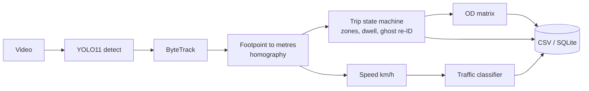
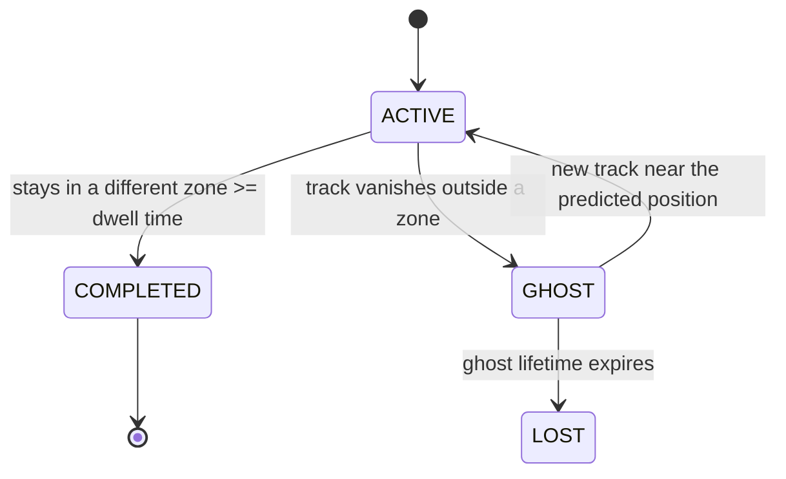

# CCTV traffic sensor

[](https://github.com/eyadstein/traffic-sensor/actions/workflows/tests.yml)

Turn a fixed CCTV camera into a traffic sensor with computer vision only: no extra hardware.


## What it does

- Detects and tracks vehicles with YOLO11 (ONNX, runs on CPU) and ByteTrack.
- Estimates speed in km/h by projecting each vehicle's ground-contact point through a homography.
- Builds an origin-destination (OD) matrix over entry/exit zones you draw.
- Classifies traffic as Smooth / Moderate / Heavy from speed relative to free-flow.
- Keeps each vehicle's identity through occlusions, so a trip is counted exactly once.

The hard part is the memory, not the detection. Trackers drop IDs behind trees or other vehicles, and a naive
counter then splits one trip into two or loses it. `src/trips.py` is a small state machine that fixes this.

## How it works





- A trip is counted once, when the vehicle stays in an exit zone for the dwell time (hysteresis against boundary jitter).
- A vehicle that vanishes mid-road becomes a ghost for a few seconds. A new track of a compatible class that appears
  near its constant-velocity prediction inherits its identity and origin.
- Vehicles that appear mid-frame get an origin guessed from their heading. These are reported (`origin_guessed`).

## Quick start

Windows (PowerShell):

```powershell
python -m venv .venv
.\.venv\Scripts\Activate.ps1
pip install -r requirements.txt
curl.exe -L -o data/yolo11n.onnx https://github.com/ultralytics/assets/releases/download/v8.4.0/yolo11n.onnx
.\run_demo.ps1
```

Linux / macOS:

```bash
python -m venv .venv && source .venv/bin/activate
pip install -r requirements.txt
curl -L -o data/yolo11n.onnx https://github.com/ultralytics/assets/releases/download/v8.4.0/yolo11n.onnx
./run_demo.sh
```

The demo generates a synthetic 4-way intersection with exact ground truth and compares stitching on and off.

## Use it on your own footage

```bash
python src/calibrate.py --video data/clip.mp4 --out configs/clip.yaml --zones FAR,NEAR   # click road points + zones
python src/pipeline.py  --video data/clip.mp4 --config configs/clip.yaml --out output/clip
streamlit run src/dashboard.py                                                           # view the results
```

Calibration needs four road-surface points that form a rectangle of known size. The accuracy of km/h depends
on that measurement. `src/scale_fix.py` rescales speeds from one measured distance.

UA-DETRAC sequences are JPEG folders; convert one without unpacking the whole zip:

```bash
python src/ua_detrac_to_video.py --zip ua_detrac_test_set.zip --seq MVI_39031 --out data/MVI_39031.mp4
```

Outputs in `output/<run>/`: `annotated.mp4`, `tracks.csv`, `trips.csv`, `od_matrix.csv`, `traffic_timeline.csv`,
`merge_events.json`, `summary.json`. Useful flags: `--no-stitch` (ablation), `--no-video` (faster).

## Validation

| Check | Result |
|---|---|
| Synthetic intersection (106 vehicles, simulated occlusions, noisy detector): vehicles with correct origin and destination | 91% with stitching, 77% without |
| Same scene: tracker ID breaks | 37 without stitching, 9 with |
| Same scene: speed error (known calibration geometry) | about 1 km/h MAE |
| Real clip, UA-DETRAC MVI_39031 (`yolo11n`): hand count of two 10 s windows | 10 by hand vs 8 by the pipeline, within 1 per direction and window |

Details and limits: [docs/validation.md](docs/validation.md). The real-clip check covers about 20 vehicles, so it
shows the zone logic works but is not an accuracy figure.

## Limitations

- On the real clip, km/h and the Smooth/Moderate/Heavy label are not trustworthy: the calibration rectangle was
  estimated, not measured. Speed accuracy is validated only on the synthetic scene.
- The homography assumes a flat road. Accuracy drops toward the horizon.
- `yolo11n` misses some far or small vehicles. Dense traffic and trees still cause ID switches.
- Validated on one real clip so far.

## Project structure
src/pipeline.py main loop: detect, track, speed, trips, outputs
src/trips.py trip state machine (identity, OD counting, speed)
src/traffic.py traffic condition classifier
src/geometry.py homography and zones
src/detector.py YOLO11 ONNX detector
src/calibrate.py click calibration; src/scale_fix.py rescale speeds from one distance
src/dashboard.py Streamlit dashboard; src/export_db.py SQLite / Parquet export
src/synth.py, evaluate.py synthetic scene with ground truth and its scorer
src/window_counts.py pipeline counts in a time window, for hand-count checks
tests/ unit tests and an end-to-end synthetic benchmark


## Development

```bash
python -m pytest -q                 # everything, about a minute
python -m pytest -q -m "not slow"   # fast unit tests only
```

GitHub Actions runs the same tests on every push.

## Credits and license

MIT, see [LICENSE](LICENSE). Built on YOLO11 (Ultralytics), ByteTrack (Zhang et al., arXiv:2110.06864),
and supervision (Roboflow). Real-footage tests use UA-DETRAC (arXiv:1511.04136): check its terms before reusing
the footage.
