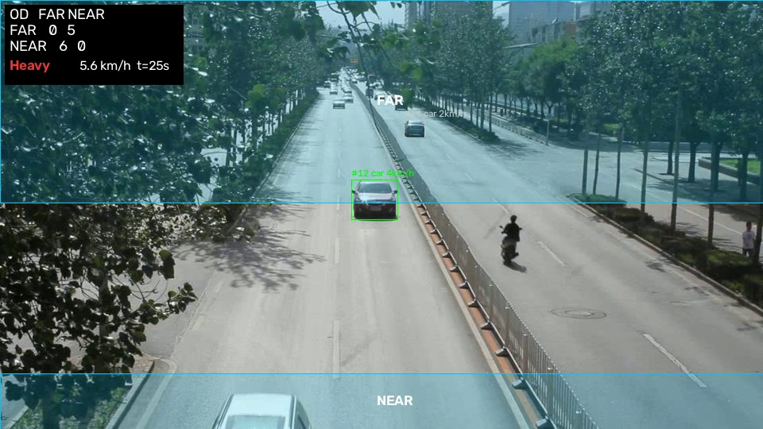

# CCTV → Intelligent Traffic Sensor

YOLO11 (ONNX) + ByteTrack + ground-plane homography + trip state machine → speed (km/h), OD matrix, Smooth/Moderate/Heavy.

## Setup (Linux/macOS/Windows)
```bash
python -m venv .venv
source .venv/bin/activate          # Windows: .venv\Scripts\activate
pip install -r requirements.txt
mkdir -p data output configs
# detector weights (YOLO11n exported to ONNX)
curl -L -o data/yolo11n.onnx https://github.com/ultralytics/assets/releases/download/v8.4.0/yolo11n.onnx
# or a bigger/better model:  pip install ultralytics && yolo export model=yolo11s.pt format=onnx
```

## 1. Validate the logic (no footage needed)
```bash
./run_demo.sh        # synthetic intersection + stitching ablation
```

## 2. Run on your own fixed-camera clip
```bash
python src/calibrate.py --video data/my_clip.mp4 --out configs/my_clip.yaml     # click 4 road points + 4 zones
python src/pipeline.py  --video data/my_clip.mp4 --config configs/my_clip.yaml --out output/my_clip
```
Outputs in `output/my_clip/`: `annotated.mp4`, `tracks.csv`, `trips.csv` (status/origin/dest/speed per vehicle),
`od_matrix.csv`, `traffic_timeline.csv`, `merge_events.json`, `summary.json`.
Add `--no-stitch` for the ablation, `--no-video` for speed.

## Tuning (config yaml)
- `tracker.buffer_frames`: how long ByteTrack keeps lost tracks (≈ 2 s of frames).
- `trips`: `dwell_s` (hysteresis before a trip counts as complete), `ghost_ttl_s` (how long a vanished vehicle waits to be re-identified), `gate` (metres of re-ID search radius).
- `traffic.free_flow_kmh`: set it to the road's real free-flow speed; otherwise it is estimated from the 90th-percentile speed seen.
- Better models: use `yolo11s/m` ONNX and raise `detector.imgsz` for small/far vehicles.

## Known limits
- Homography assumes a flat road; keep calibration points near the area you measure.
- Validate on your footage: hand-count a clip for OD, GPS-drive for speed.
- supervision's ByteTrack is deprecated (removed in 0.31), so the version is pinned.

## Windows (PowerShell)

    python -m venv .venv
    .\.venv\Scripts\Activate.ps1
    pip install -r requirements.txt
    python src/synth.py --out data/synth
    curl.exe -L -o data/yolo11n.onnx https://github.com/ultralytics/assets/releases/download/v8.4.0/yolo11n.onnx
    python -W ignore src/pipeline.py --video data/synth.mp4 --config configs/synth.yaml --detector gt --gt data/synth_gt.json --out output/synth_stitch --no-video
    python src/evaluate.py --gt data/synth_gt.json --run output/synth_stitch

Add `--no-stitch` and `--out output/synth_nostitch` for the ablation. For a UA-DETRAC sequence:
`python src/ua_detrac_to_video.py --zip <zip> --seq MVI_39031 --out data/MVI_39031.mp4`

## Validation so far

- Synthetic 4-way intersection (106 vehicles, simulated occlusions, noisy ground-truth detector): correct origin and destination per vehicle 77% without ID stitching vs 91% with it; ID breaks 37 vs 9; speed MAE about 1 km/h.
- Real footage (UA-DETRAC MVI_39031, yolo11n): hand-counted two 10 s windows. Pipeline within 1 per direction in both (10 hand vs 8 pipeline), so it may undercount slightly. Small sample.
- Not validated: km/h on real footage (calibration length was estimated, not measured) and the Smooth/Moderate/Heavy label, which depends on speed.



## Credits

UA-DETRAC dataset (arXiv:1511.04136). Check its terms before reusing the footage.
